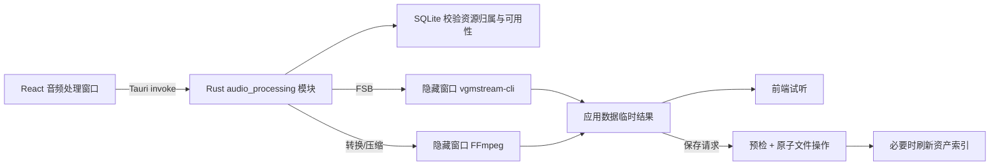

# 音频处理功能需求与技术设计

## 1. 目标

在 Windows 桌面端音频资源明细中增加三个完全本地执行的工具：FSB 转 WAV、音频格式转换、音频压缩。三个工具沿用图片抠图的“打开操作窗口—展示原文件—执行处理—试听结果—选择保存方式”流程，不上传音频，也不依赖用户自行安装命令行工具。

## 2. 范围与入口

- 仅本地索引中状态为“可用”的音频显示处理入口；缺失资源和演示数据不显示。
- FSB 转 WAV 仅对 `.fsb` 显示；格式转换和压缩对除 FSB 外、可由内置 FFmpeg 解码的音频显示。FSB 可先转成 WAV，再继续转换或压缩。
- `.fsb` 纳入音频扫描扩展名，允许在音频资源明细中被选择和处理。
- 三个入口放在资源明细的操作区，不放在独立工具页。

不在本期范围：剪辑、响度标准化、批量选择多个资产、编码回 FSB、加密 FSB 密钥管理和处理任务取消。

## 3. 用户流程

### 3.1 FSB 转 WAV

1. 用户点击“FSB 转 WAV”，窗口展示 FSB 原文件名、格式和大小；可播放的原文件提供试听，不可直接播放时给出说明。
2. 点击“开始转换”，应用调用随安装包分发的 `vgmstream-cli`。
3. FSB 只有一个音轨时生成一个 WAV；含子音轨时使用 `-S 0` 解码全部子音轨，并分别展示文件名、大小和试听控件。
4. 用户选择保存方式并保存结果。

### 3.2 音频格式转换

1. 用户点击“格式转换”，窗口展示并可试听原音频。
2. 用户可多选 MP3、WAV、FLAC、AAC、OGG、M4A；当前格式默认不选，用户仍可主动选择它进行重编码。
3. 点击“开始转换”后，各格式独立生成结果；任一输出失败则本次任务失败并清理临时结果，避免半完成状态。
4. 处理成功后逐条展示输出格式、大小和试听控件，再进入保存。

### 3.3 音频压缩

1. 用户点击“音频压缩”，窗口展示并可试听原音频。
2. 用户选择压缩强度：轻度（256 kbps）、均衡（160 kbps，默认）、强力（96 kbps）。
3. 输出统一为 MP3，以获得可预测的压缩率和 Windows/WebView 播放兼容性。
4. 结果区展示原始大小、压缩后大小和节省比例，并提供试听与保存。

## 4. 保存语义

三个工具复用一致的保存选项：

- 另存为：选择目标文件夹并填写不带扩展名的基础名称。
- 原文件目录：填写基础名称并保存到源音频所在目录。
- 覆盖原文件：仅单个输出时可用。应用先备份原文件，再原子替换并更新 SQLite 索引；输出扩展名变化时同步重命名资源路径。前端必须二次确认。

多输出保存使用“基础名称 + 输出标识”避免冲突；FSB 多子音轨保留 vgmstream 生成的子音轨标识。保存前统一检查全部目标，任何目标已存在时不写入任何文件。未保存结果位于应用数据缓存，关闭窗口时删除，缓存超过 24 小时也会自动清理。

## 5. 技术方案

- FFmpeg 复用现有 Windows x64 LGPL 8.1 运行时。
- vgmstream 使用官方 Windows x64 `vgmstream-cli` 发布包；构建脚本固定版本并校验 SHA-256，相关 DLL 与可执行文件整体打包。
- 所有 Windows 子进程使用 `CREATE_NO_WINDOW`，不出现终端窗口。
- FSB 解码使用 `-i` 忽略循环，防止带循环标记的素材生成超长输出；多子音轨使用 `-S 0` 和带子音轨通配符的输出名。官方用法见 [vgmstream usage](https://github.com/vgmstream/vgmstream/blob/master/doc/USAGE.md#vgmstream-cli-command-line-decoder)。
- 前端不能提交任意临时路径；读取、保存、丢弃均以任务 ID、资源 ID和结果 ID校验内存任务归属。

## 6. 编码参数

| 输出 | FFmpeg 编码参数 |
|---|---|
| MP3 | `libmp3lame`, VBR quality 2 |
| WAV | `pcm_s16le` |
| FLAC | `flac`, compression level 8 |
| AAC | 原生 `aac`, 256 kbps, ADTS |
| OGG | `libvorbis`, quality 6 |
| M4A | 原生 `aac`, 256 kbps, faststart |
| 压缩 | `libmp3lame`, 256/160/96 kbps |

所有转换只取首个音频流，丢弃视频、字幕和数据流，不复制可能含隐私或不兼容信息的源元数据。

## 7. 错误处理与安全

- 源文件缺失、资源类型不匹配、格式参数非法、运行时缺失、解码失败、超时、目标冲突和权限错误都显示可操作的中文错误。
- 单次处理最长 30 分钟；超时后终止子进程并清理本次临时文件。
- 输出必须存在且大小大于零才登记为成功结果。
- 覆盖时使用同目录临时文件和备份；替换或索引更新失败时恢复原文件。
- 多输出另存采用全量预检；写入中失败则回滚本次已创建的目标文件。

## 8. 验收标准

- 可用 FSB 在资源明细中显示“FSB 转 WAV”，普通音频不显示该按钮。
- 三个按钮均能打开窗口并展示原文件信息；可播放源文件可试听。
- FSB 能通过内置 vgmstream-cli 转为一个或多个可试听 WAV。
- 格式转换允许至少两种格式同时选择，并生成对应的全部结果。
- 压缩三档参数生效，结果显示体积与节省比例。
- 另存为、原文件目录和单结果覆盖按本设计工作；多结果不能覆盖源文件。
- 失败和关闭未保存窗口均不修改原文件、不遗留受管临时结果。
- 所有运行时子进程不弹出控制台窗口。
- TypeScript 构建、Rust 测试和完整 Tauri 桌面构建通过。
