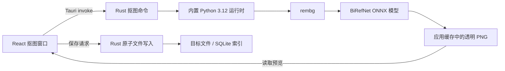

# 一键抠图功能需求与技术设计

## 1. 目标

在 Windows 桌面端的图片资源明细中提供本地 AI 抠图能力。用户可以选择 BiRefNet 模型、调整边缘参数、预览透明背景结果，并将结果另存、保存到原图目录或覆盖原图。

功能只对满足以下条件的资源开放：

- 资源类型为“图片”；
- 资源来自本地索引（资源 ID 以 `indexed-` 开头）；
- 文件状态为“可用”。

动图、视频、音频、PSD/设计文件及缺失资源不显示“一键抠图”按钮。

## 2. 用户流程

1. 用户在资源库中选择一张图片。
2. 资源明细操作区显示“一键抠图”按钮。
3. 点击后打开抠图窗口，左侧展示原图，右侧展示参数区。
4. 用户选择模型并调整参数，点击“开始抠图”。
5. 应用在本地执行 `rembg + BiRefNet`；首次使用某模型时自动下载模型文件。
6. 处理成功后，主预览切换为带棋盘格背景的透明 PNG 结果，并显示处理完成状态。
7. 用户选择保存方式：
   - 另存为：选择目标文件夹并填写结果名称；
   - 原图目录：填写结果名称，保存到原图所在目录；
   - 覆盖原图：用结果替换当前资源。
8. 保存成功后关闭窗口并提示最终路径；覆盖原图时立即刷新资源索引和预览。

窗口关闭时删除尚未保存的临时结果。处理过程中禁止关闭窗口，避免留下无法管理的后台任务。

## 3. 模型与参数

### 3.1 模型

首版提供 rembg 官方登记的三个 BiRefNet 模型：

| 模型 ID | UI 名称 | 用途 |
| --- | --- | --- |
| `birefnet-general` | BiRefNet 通用（高质量） | 默认；适合商品、角色和一般素材 |
| `birefnet-general-lite` | BiRefNet 通用轻量 | 模型较小、CPU 速度更快 |
| `birefnet-portrait` | BiRefNet 人像 | 针对人物、头发和人像边缘 |

后端使用白名单校验模型 ID，前端传入任意其他值都会被拒绝。

### 3.2 可调参数

- Alpha Matting：默认关闭；开启后改善头发、毛发和半透明边缘。
- 前景阈值：默认 `240`，范围 `0–255`。
- 背景阈值：默认 `10`，范围 `0–255`，且必须小于前景阈值。
- 边缘收缩：默认 `10`，范围 `0–40`。
- 蒙版后处理：默认关闭；用于清理小孔洞和孤立噪点。

阈值与收缩参数只在 Alpha Matting 开启时可编辑。所有数值在前端和 Rust 后端双重校验。

## 4. 技术架构

### 4.1 前端

- 新增 `BackgroundRemovalDialog` 组件，维护配置、处理、预览和保存状态。
- 新增 `backgroundRemoval.ts`，封装命令参数、返回值和 Blob URL 生命周期。
- 原图通过现有 `read_asset_preview` 命令加载。
- 结果通过专用读取命令加载，避免在处理命令返回时传输大块 JSON/Base64。
- 另存为通过已有 Tauri Dialog 插件选择文件夹。

### 4.2 Rust/Tauri

新增四个命令：

- `remove_image_background`：验证资源及参数，运行 Python，生成临时 PNG，返回任务 ID 和尺寸。
- `read_background_removal_preview`：按任务 ID 读取临时 PNG 字节。
- `save_background_removal`：验证任务归属及保存参数，执行原子保存并返回最终路径。
- `discard_background_removal`：窗口关闭或重新处理时清理临时结果。

安全边界：

- 任务记录只保存在内存中，包含任务 ID、源资源 ID、源路径和临时结果路径；前端不能提交任意临时文件路径。
- 文件名沿用现有 Windows 名称规则，拒绝保留名、控制字符、路径分隔符和尾部空格/句点。
- 另存和保存到原图目录时，如果目标已存在则拒绝覆盖。
- 临时结果位于应用缓存目录，启动时/生成前清理过期文件。
- Python 子进程统一使用 `CREATE_NO_WINDOW`，不会显示控制台窗口。
- Python 标准输出和错误输出都通过管道捕获，错误信息经过长度限制后显示给用户。
- 单次处理超时为 20 分钟，超时后终止子进程。

### 4.3 Python/rembg 运行时

- 构建阶段由 `scripts/prepare-rembg.ps1` 下载固定版本的 Windows x64 Python Embeddable 运行时。
- 构建脚本安装固定版本 `rembg[cpu,cli]`，生成就绪标记，重复构建不重复下载。
- Tauri 将运行时作为资源打包，用户无需安装 Python、pip 或 rembg。
- Python 辅助脚本直接调用 `rembg.new_session` 和 `rembg.remove`，而不是拼接 shell 命令。
- `U2NET_HOME` 指向应用数据目录下的 `models/rembg`。模型首次使用时由 rembg 下载，之后离线复用。
- 首版使用 ONNX Runtime CPU 后端，避免要求用户安装特定 CUDA/cuDNN 版本。后续可在不改变前端协议的情况下增加 GPU 后端。

## 5. 保存语义

抠图输出统一为带 Alpha 通道的 PNG。

### 5.1 另存为

- 用户必须选择文件夹。
- 用户填写不带扩展名的名称，应用自动追加 `.png`。
- 目标存在时提示改名，不进行静默覆盖。

### 5.2 保存到原图目录

- 用户必须填写不带扩展名的名称，默认值为 `<原文件名>-抠图`。
- 应用自动追加 `.png`。
- 目标存在时提示改名。

### 5.3 覆盖原图

- PNG 原图：通过“同目录临时文件 → 原图备份 → 结果替换 → 删除备份”的顺序原子替换；失败时尽力回滚。
- 非 PNG 原图：为了保留透明通道，结果改为同名 `.png`，成功后移除原格式文件；如果同名 PNG 已存在则拒绝操作。UI 必须明确提示会转换格式。
- 覆盖成功后同步更新当前 SQLite 索引记录的路径、名称、扩展名、大小、修改时间、尺寸和预览状态，并清理旧缩略图。
- 数据库更新失败时尽力恢复原文件；不能静默留下文件与索引不一致的状态。

## 6. 异常与交互状态

- 运行时缺失/损坏：提示重新安装应用或重新构建运行时。
- 首次模型下载：处理区显示“首次使用会下载模型，耗时取决于网络”；不伪造百分比进度。
- 网络失败：保留窗口和参数，允许用户重试。
- 图片解码失败、内存不足、模型推理失败：显示 rembg 的精简错误，不影响原图。
- 保存冲突或权限不足：保留临时结果和窗口，允许改名或切换目录后重试。
- 关闭已处理但未保存的窗口：直接丢弃缓存，不修改原图。

## 7. 验收标准

- 只有可用的本地“图片”资源显示“一键抠图”。
- 窗口能展示原图、模型和参数控件。
- 三个 BiRefNet 模型可选，默认通用高质量模型。
- 完成后预览切换到透明背景结果。
- 三种保存方式均按本设计的路径、命名和冲突规则工作。
- 覆盖保存后当前资源名称、格式、尺寸和缩略图可刷新。
- 处理和保存失败不会破坏原图。
- 所有运行时子进程在 Windows 上不显示控制台窗口。
- TypeScript 构建、Rust 测试和完整 Tauri 桌面构建通过。

## 8. 后续迭代

- 增加 NVIDIA CUDA/DirectML 等可选硬件加速。
- 提供模型下载状态、大小和删除缓存入口。
- 增加原图/结果拖动对比、缩放和蒙版可视化。
- 支持批量抠图与队列取消。
