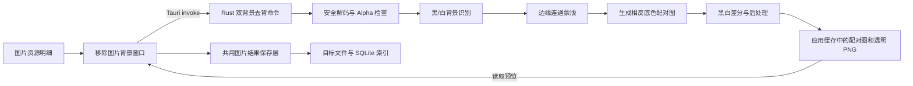

# “移除图片背景”功能需求与技术设计

## 1. 文档状态

- 目标项目：Caevir Windows（`mavo-windows`）
- 功能入口：图片资源明细
- 按钮名称：**移除图片背景**
- 当前阶段：已完成首版实现，等待真实业务素材验收与参数校准
- 实现日期：2026-08-09
- 参考实现：`E:\Projects\imgae-data-tools-online\lib\doubleBackgroundMatte.ts` 与 `components\DoubleBackgroundMatteTool.tsx`
- 参考版本：`5951681b8b2fa746e180d47895852e97e4454464`

## 2. 目标与范围

在图片资源明细中新增独立的“移除图片背景”操作。应用识别当前图片是否为纯黑或纯白背景，生成同一主体在相反底色上的配对图，再使用黑白双背景差分恢复 Alpha 通道并输出透明 PNG。

首版范围：

- 只处理本地索引中状态为“可用”的静态图片；
- 自动识别黑色或白色纯色背景；
- 黑底图生成白底配对图，白底图对称生成黑底配对图；
- 复用参考项目的双背景差分、后处理和边缘侵蚀思路；
- 提供原图、生成的配对图和透明结果预览；
- 支持另存为、保存到原图目录和覆盖原图；
- 所有处理在本机完成，不上传图片，不启动或显示命令行窗口；
- 首版只处理当前资源，不做批量任务。

不在首版范围内：

- 任意场景背景、渐变背景或复杂纹理背景的通用换背景；
- 动图逐帧处理；
- 视频、PSD、设计文件和缺失资源；
- 自动替代现有的 BiRefNet“一键抠图”。

## 3. 与现有“一键抠图”的关系

两项功能并存，定位不同：

| 功能 | 技术路线 | 适用图片 | 优点 | 主要限制 |
| --- | --- | --- | --- | --- |
| 一键抠图 | rembg + BiRefNet | 人像、商品、普通场景 | 适用范围广 | 首次需下载模型，推理较慢，结果带模型不确定性 |
| 移除图片背景 | 纯色背景识别 + 配对图生成 + 黑白差分 | 黑底或白底的特效、图标、玻璃、发光素材 | 本地确定性处理，速度快，可针对半透明边缘调节 | 只适合满足纯色背景假设的素材 |

图片明细中保留现有“一键抠图”按钮，并新增“移除图片背景”按钮。背景无法可靠识别时，新功能明确提示改用“一键抠图”，不自动切换算法或下载模型。

## 4. 可行性边界

### 4.1 双背景差分的成立条件

对同一前景颜色 `F`、同一 Alpha `α`，在黑、白背景上的合成结果分别为：

```text
C_black = αF
C_white = αF + (1 - α) × 255
```

因此可由两张真实配对图的差值反推：

```text
α = 1 - (C_white - C_black) / 255
```

黑白图必须尺寸、位置、缩放、姿态和前景渲染完全一致，只有背景颜色不同。

### 4.2 单张压平图片的信息限制

如果输入只有一张已经压平的黑底图，`α` 与 `F` 存在多组可能解，无法无损推出原始透明度。所谓“生成白底配对图”必须先通过纯色键控、边界连通分析或模型推理估计背景蒙版；随后执行双背景差分，只能整理和调节这份估计，不能恢复输入中已经丢失的信息。

因此首版必须遵守以下产品边界：

- 不宣称对单张黑底或白底图进行无损 Alpha 恢复；
- 仅在边缘背景足够接近纯黑或纯白且识别置信度达标时自动处理；
- 对主体与背景同色、主体贴边、重阴影、JPEG 色块和大范围半透明区域显示风险提示；
- 置信度不足时停止处理，保留原图，并建议使用现有“一键抠图”；
- 实现前先用实际业务素材验证识别阈值，不能只用合成测试图确定参数。

## 5. 用户流程

1. 用户选择一张可处理的图片资源。
2. 图片资源明细操作区显示“移除图片背景”。
3. 用户点击按钮，打开独立处理窗口；应用读取原文件并分析边缘背景。
4. 应用显示识别结论：黑色背景、白色背景、已有透明通道或无法可靠识别，并展示置信度与简短说明。
5. 识别为黑底时生成白底配对图；识别为白底时生成黑底配对图。
6. 应用按固定顺序生成透明结果：背景蒙版估计、相反底色合成、黑白差分、可选后处理、可选边缘侵蚀。
7. 用户可在“原图 / 配对图 / 透明结果”之间切换，并在棋盘格、黑色、白色或自定义颜色上检查边缘。
8. 用户调整参数后点击“重新处理”；上一次未保存的临时结果被安全替换。
9. 用户选择保存方式并保存透明 PNG。
10. 保存成功后关闭窗口；覆盖原图时刷新资源索引、尺寸、格式和缩略图。

处理过程中禁止关闭窗口。关闭已完成但未保存的窗口时删除临时配对图和透明结果，不修改原图。

## 6. 入口与交互设计

### 6.1 按钮显示条件

前端只在全部条件满足时显示按钮：

- `asset.kind === "图片"`；
- 资源 ID 以 `indexed-` 开头；
- `asset.availability !== "missing"`；
- 扩展名属于 Rust `image` 当前已启用解码器支持的白名单：PNG、JPEG、WebP、BMP、TIFF。

AVIF、HEIC/HEIF、DNG/RAW、TGA、HDR、EXR、ICO 等虽然可能被索引为图片，但首版不显示按钮，避免前端允许、后端无法解码的不一致。

### 6.2 明细操作区

图片工具存在时采用多行网格：

- 第一行：查看原图；
- 第二行：一键抠图、移除图片背景；
- 第三行：一键压缩（仅 PNG）和更多操作入口。

具体布局应根据窗口最小宽度检查，按钮文字不得被截断为无法辨认的状态。

### 6.3 处理窗口

窗口沿用现有抠图窗口的视觉语言，但使用独立标题和状态：

- 标题：“移除图片背景”；
- 左侧：大图预览与“原图 / 配对图 / 透明结果”切换；
- 右侧：识别结果、参数、保存方式与错误信息；
- 底部：取消、重新处理、保存；
- 透明结果默认使用棋盘格预览，并可切换纯黑、纯白和自定义颜色检查黑边/白边。

### 6.4 参数

| 参数 | 建议默认值 | 范围 | 说明 |
| --- | ---: | ---: | --- |
| 背景变更范围 | 全部背景变更 | 仅边缘/全部 | “仅边缘”使用边缘连通背景；“全部”处理全图中符合容差的背景 |
| 背景识别容差 | 18 | 4–48 | 控制边缘像素与黑/白背景种子颜色的最大色差 |
| 蒙版柔化宽度 | 2 px | 0–8 px | 只作用于已识别背景与前景的边界，避免全图模糊 |
| 双背景容差 | 70 | 50–100 | 对应参考实现的 `tolerance` |
| 边缘对比 | 53 | 50–100 | 对应参考实现的 Alpha gamma 调整 |
| 去背景后处理 | 开启 | 开/关 | 清理低 Alpha 噪点和小连通块 |
| 边缘侵蚀 | 0 | 0–100 | 逐层硬削透明边界，默认不侵蚀 |

背景识别容差和蒙版柔化参数属于“配对图生成”，双背景容差和边缘对比属于“差分恢复”，界面上必须分组，避免用户混淆。

## 7. 算法设计

### 7.1 解码与安全限制

- 在 Rust 后端使用现有 `image` crate 解码为 RGBA8，不引入新的 Python、模型或外部进程；
- 复用现有预览安全限制：单边最大 `16,384` 像素、总像素最大 `64 × 1024 × 1024`、解码分配最大 `256 MiB`；
- 由于该流程会同时保留源图、配对图、结果图和多份蒙版缓冲，首版额外设置 `12 × 1024 × 1024` 像素工作集上限，防止大图处理耗尽内存；
- 保留原始宽高，不缩放后再处理；
- 结果统一编码为 8 位 RGBA PNG；
- 后台计算通过 `spawn_blocking` 执行，避免阻塞 Tauri 异步运行时。

### 7.2 已有 Alpha 的分支

如果原图存在非全不透明 Alpha：

- 状态显示“图片已有透明通道”；
- 直接以原始 Alpha 作为结果基线，不再猜测纯色背景；
- 可按用户选择执行后处理和边缘侵蚀；
- 仍可另存为规范化 PNG，但默认不建议覆盖原图。

该分支避免把预览底色误认为文件中真实存在的黑色或白色背景。

### 7.3 背景识别

1. 从图片四周采集边缘环，环宽取 `max(2 px, min(width, height) × 1%)`，并限制最大宽度，避免大图采样成本失控。
2. 对采样像素计算亮度、RGB 通道跨度、颜色中位数和离散程度。
3. 同时计算候选背景的边缘匹配率：像素与纯黑或纯白的 RGB 距离是否在“背景识别容差”内。
4. 满足以下初始规则才分类：
   - 黑底：中位亮度不高于 24，且边缘匹配率不低于 85%；
   - 白底：中位亮度不低于 231，且边缘匹配率不低于 85%；
   - 两者均不满足：`unknown`。
5. 置信度由匹配率、颜色离散程度和四边一致性共同计算；任一整条边明显冲突时降低置信度。

上述数值是实现起点，必须通过阶段 0 的真实素材集校准后固定，并写入 Rust 单元测试。

### 7.4 背景连通区与初始 Alpha

背景范围由用户根据素材结构选择；全图替换可以处理封闭背景，但也可能移除主体内部与背景同色的真实内容。处理流程：

1. “仅变更边缘背景”从所有符合候选背景颜色的边缘像素建立种子，再使用 8 邻域洪泛填充，只扩展到与背景颜色距离不超过阈值的像素；
2. “全部背景变更”扫描全图，把所有符合黑/白背景颜色容差的像素纳入背景，不要求与图片边缘连通，因此可以处理被网格线、边框或前景包围的内部背景区域；
3. 全部背景模式可能同时移除主体内部与背景同色的真实内容，界面必须明确说明，由用户按素材类型选择；
4. 对已识别背景与前景的边界建立 0–8 像素的柔化带，估算初始 Alpha；
5. 主体触边或前景与背景同色时标记诊断风险，置信度不足则拒绝自动输出。

### 7.5 生成相反底色配对图

根据初始 Alpha `α_est` 和输入像素估算前景颜色，再在相反底色上重新合成：

```text
黑底输入：F_est = C_black / max(α_est, ε)
白底配对：C_white_est = α_est × F_est + (1 - α_est) × 255

白底输入：F_est = (C_white - (1 - α_est) × 255) / max(α_est, ε)
黑底配对：C_black_est = α_est × F_est
```

所有通道结果限制到 `0–255`，`α_est` 接近 0 时前景颜色置 0，避免除零和背景区彩色噪点。生成的配对图仅保存到应用缓存，除非未来明确增加“导出诊断图”，否则不写入用户目录。

### 7.6 黑白双背景差分

移植参考实现的核心计算，并保持参数语义一致：

```text
diff = average(C_white - C_black)
tol_scale = 0.5 + tolerance / 100
gamma = 0.5 + edge_contrast / 100
alpha = clamp(255 - diff × tol_scale, 0, 255)
alpha = 255 × pow(alpha / 255, gamma)
foreground_rgb = C_black × 255 / max(alpha, 1)
```

实现时使用浮点中间值、统一舍入和通道钳制。算法单元测试要使用真实黑白合成对验证，而不能只验证由同一估计蒙版生成的配对图，否则测试会形成循环自证。

### 7.7 后处理

与参考实现保持行为对齐：

- 去背景后处理：将结果重复 source-over 合成 4 次；清除 Alpha 小于 `ceil(255 × 0.2) = 51` 的像素；删除小于动态面积阈值的 8 连通小岛；
- 小岛最小面积：总像素大于 2,000,000 时为 20，大于 800,000 时为 16，否则为 12；
- 边缘侵蚀：UI 的 0–100 映射为 0–56 遍；每遍只处理当前贴透明背景的 4 邻域外层像素，每次 Alpha 最多减少 22；
- Alpha 变为 0 时同步把 RGB 清零，防止透明像素携带脏色。

## 8. 技术架构



### 8.1 前端

建议新增：

- `src/components/DoubleBackgroundRemovalDialog.tsx`：窗口状态、参数、预览、重试和保存；
- `src/lib/doubleBackgroundRemoval.ts`：可用性判断、Tauri 命令参数和返回类型、Blob URL 生命周期。

建议修改：

- `src/components/DetailPanel.tsx`：新增按钮、窗口状态和图片工具布局；
- `src/App.tsx`：接收保存结果，复用现有资源刷新逻辑；
- `src/styles.css`：新增窗口与多图片工具按钮布局样式。

### 8.2 Rust/Tauri

建议新增 `src-tauri/src/double_background_removal.rs`，包含背景识别、蒙版、配对图、差分和后处理。建议命令：

| 命令 | 作用 |
| --- | --- |
| `remove_image_background_by_double_background` | 校验资源与参数，生成配对图和透明结果，返回任务与诊断信息 |
| `read_double_background_removal_preview` | 按任务 ID 和 `counterpart/result` 变体读取 PNG 字节 |
| `save_double_background_removal` | 按保存模式写入结果，并在覆盖时更新索引 |
| `discard_double_background_removal` | 清理未保存任务的所有缓存文件 |

处理命令建议返回：

```ts
interface DoubleBackgroundRemovalResult {
  jobId: string;
  width: number;
  height: number;
  detectedBackground: "black" | "white" | "transparent";
  confidence: number;
  borderMatchRatio: number;
  warnings: string[];
}
```

`unknown` 作为错误返回，并包含可展示的失败原因；不创建可保存任务。

### 8.3 共用任务与保存层

现有 `background_removal.rs` 已实现成熟的临时任务、预览读取、三种保存方式、原子覆盖、SQLite 更新和缩略图失效逻辑。新功能不应复制一份长期分叉的保存代码。

首版实现从现有 `background_removal.rs` 暴露算法无关的内部保存入口
`save_transparent_image_result`，供 BiRefNet 和双背景流程共同调用，覆盖以下能力：

- 任务 ID、源资源归属、创建时间和结果路径；
- 24 小时过期清理；
- 按任务和资源校验预览访问；
- 新文件保存、路径冲突检查和安全文件名；
- PNG/非 PNG 覆盖、备份、回滚、SQLite 索引更新和事件通知；
- 保存或丢弃后的缓存清理。

现有 BiRefNet 流程与新双背景流程共同使用该层。重构前先为现有保存语义补足测试，确保“一键抠图”没有行为回归。

## 9. 缓存与保存语义

- 临时目录建议为应用数据目录下的 `double-background-removal/`；
- 每个任务保存生成的相反底色 PNG 和最终透明 PNG，任务记录只在内存中保存路径；
- 前端只能提交任务 ID、资源 ID 和预览变体，不能提交任意缓存文件路径；
- 新任务成功后再丢弃该窗口的旧任务，避免重新处理失败时丢失上一次可用结果；
- 另存为和原图目录模式默认名称为 `<原文件名>-去背景.png`，已存在时拒绝静默覆盖；
- 覆盖原图沿用现有抠图语义：PNG 原子替换；非 PNG 转为同名 PNG，并在安全更新索引后移除旧格式；
- 保存或主动丢弃后立即清理配对图和透明结果；启动或生成任务前清理超过 24 小时的遗留文件。

## 10. 错误与降级

| 场景 | 行为 |
| --- | --- |
| 背景不是可靠纯黑/纯白 | 停止，不生成可保存结果；建议使用“一键抠图” |
| 主体明显接触多条边 | 降低置信度并提示可能误删；低于门槛时停止 |
| 图片已有 Alpha | 跳过背景猜测，进入透明图后处理分支 |
| 不支持的格式或解码失败 | 保留窗口和原图，展示明确格式/解码错误 |
| 图片尺寸或内存超过安全限制 | 停止处理，提示尺寸过大 |
| 参数无效 | 前端禁用提交，Rust 再次校验并拒绝 |
| 重新处理失败 | 保留上一次成功结果，不覆盖其任务 |
| 保存冲突或无权限 | 保留任务和窗口，允许改名或换目录重试 |
| 覆盖时索引更新失败 | 回滚原文件；若回滚也失败，报告两个错误 |

## 11. 测试计划

### 11.1 Rust 单元测试

- 用已知 RGBA 前景分别合成真实黑底图、白底图，验证差分得到的 Alpha 和 RGB 误差；
- 纯黑、近黑、纯白、近白和非纯色边缘的背景分类及置信度；
- 边缘洪泛只删除与边缘连通的背景，不删除主体内部孤立同色区域；
- 主体贴边、全黑图、全白图、空尺寸和极小图片；
- 已有 Alpha 分支保持宽高和透明通道；
- 低 Alpha 清理、小岛阈值和 0/最大边缘侵蚀；
- 无效参数、过大图片、任务归属错误、过期任务和预览变体白名单；
- 三种保存模式、同名冲突、非 PNG 覆盖、索引更新失败回滚。

### 11.2 前端测试与构建检查

- 按钮只对支持的本地静态图片显示；
- 图片工具按钮为 1、2、3 个时布局均正常；
- 处理中禁止关闭和重复提交；
- 原图、配对图、透明结果切换正确，Blob URL 均能释放；
- `unknown`、警告、保存冲突和重试状态可恢复；
- `pnpm build` 通过。

### 11.3 真实素材验收集

至少覆盖：

- 黑底和白底图标；
- 发光、烟雾、玻璃和软阴影；
- 主体中包含纯黑或纯白区域；
- 主体触边与不触边；
- JPEG 压缩噪点；
- 非均匀黑/白背景、渐变和纹理背景；
- 大尺寸 PNG、JPEG、WebP、BMP、TIFF；
- 原本已带透明通道的 PNG/WebP。

对每张样本记录识别类型、置信度、误删区域、边缘色偏和推荐参数。阶段 0 未通过前不进入完整 UI 实现。

## 12. 验收标准

- 图片资源明细新增且准确显示“移除图片背景”按钮；
- 现有“一键抠图”和“一键压缩”功能及布局不回归；
- 支持的纯黑/纯白背景图片可自动识别，并生成相反底色配对图；
- 结果按参考公式执行双背景差分，默认参数为双背景容差 70、边缘对比 53；
- 用户可以查看识别结论、置信度、警告、配对图和透明结果；
- 非纯色背景不会静默生成看似成功的错误结果；
- 输出为透明 PNG，三种保存方式与现有抠图保持一致；
- 失败、取消或关闭窗口不修改原图，不遗留长期临时文件；
- 覆盖成功后资源名称、格式、尺寸和缩略图立即刷新；
- 所有处理均在本地完成，运行时不显示系统控制台窗口；
- Rust 测试、TypeScript 构建和完整 Tauri 桌面构建通过。

## 13. 实施顺序

### 阶段 0：算法验证

1. 收集实际业务图片和期望透明结果；
2. 独立实现背景识别、边缘连通蒙版和配对图生成原型；
3. 将结果与参考项目的真实双图输出、现有 BiRefNet 输出对比；
4. 校准阈值并确认“可自动处理 / 应拒绝”的边界；
5. 由产品侧确认质量门槛。

### 阶段 1：后端核心与测试

1. 提取共用图片结果任务与保存层，并回归现有抠图；
2. 移植双背景差分、后处理和侵蚀算法；
3. 实现背景识别、蒙版、配对图和诊断信息；
4. 完成 Rust 单元测试。

### 阶段 2：Tauri 协议与前端窗口

1. 注册四个新命令并实现 TypeScript 封装；
2. 新增处理窗口、预览切换、参数和保存交互；
3. 在图片明细接入“移除图片背景”按钮；
4. 接入覆盖后的资源刷新。

### 阶段 3：完整验证

1. 运行真实素材验收集；
2. 检查临时文件、失败回滚和内存峰值；
3. 强制停止全部 `caevir.exe`；
4. 执行完整桌面应用构建，不以仅前端构建代替；
5. 对“一键抠图”“移除图片背景”“一键压缩”执行回归验收。

## 14. 实施前需要确认的产品结论

本方案建议直接采用以下结论：

1. “移除图片背景”作为独立功能保留，与“一键抠图”并存；
2. 首版同时支持黑底与白底，白底路径与黑底路径对称；
3. 首版只承诺纯色背景素材，复杂背景明确转用“一键抠图”；
4. 识别置信度不足时拒绝自动保存，不提供“强制成功”的假状态；
5. 默认启用噪点/小岛后处理，默认不执行边缘侵蚀；
6. 实现前必须先用实际素材完成阶段 0，确认单张压平图片的质量满足业务需求。
